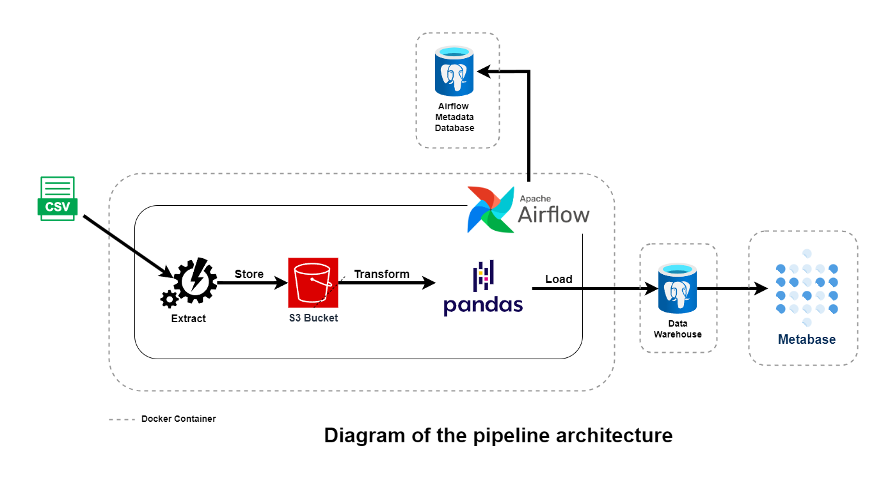
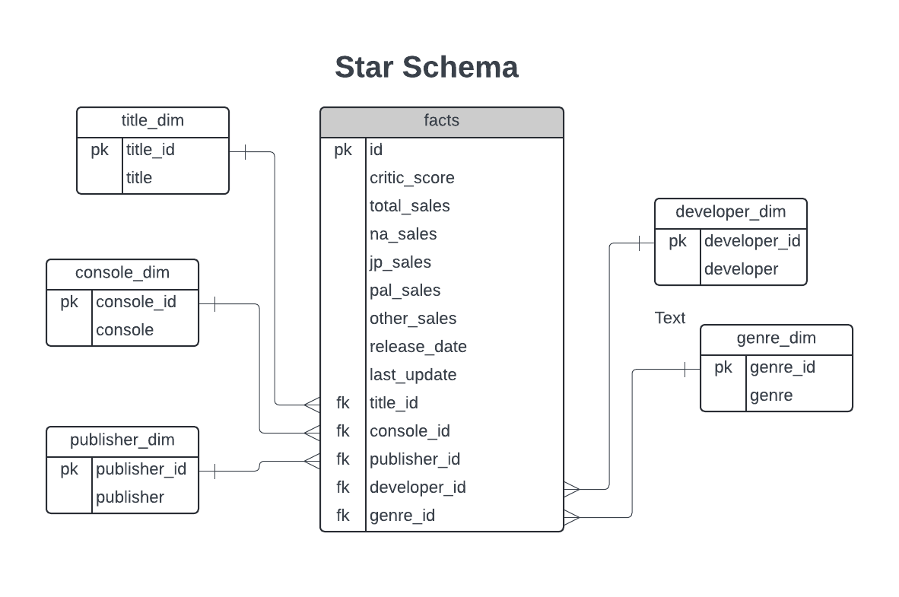

# Video Game Sales Insights

This is an end-to-end ETL pipeline to pull video game sales data from this [Kaggle Dataset](https://www.kaggle.com/datasets/ujjwalaggarwal402/video-games-dataset), load it into a data warehouse and provide a visualization dashboard using `Metabase`.

## Run Data Pipeline

### Run on codespaces

You can run this data pipeline using GitHub codespaces. Follow the instructions below.

1. Create codespaces by `Code` button on the top right, navigating to `Codespces` and then clicking on `Create codespaces on master` button.
2. Wait for codespaces to start, then in the terminal type `make up` and wait for it to complete.
3. After `make up` has completed, go to the `ports` tab, you will find links exposing some ports, what we are interested in are the links exposing ports:
   - `3000`: the `Metabase` UI.
   - `8080`: the `Airflow` UI.

**Note** Make sure to switch off codespaces instance, you only have limited free usage; see docs [here](https://github.com/features/codespaces#pricing).

### Run locally

To run locally, you need:

1. [git](https://git-scm.com/book/en/v2/Getting-Started-Installing-Git)
2. [Github account](https://github.com/)
3. [Docker](https://docs.docker.com/engine/install/) with at least 4GB of RAM and [Docker Compose](https://docs.docker.com/compose/install/).

Clone the repo and run the following commands to start the data pipeline:

```bash
git clone https://github.com/ahgarawani/video_games_insights_de_project.git
cd video_games_insights_de_project
sudo make up
```

Go to:

- [http:localhost:3000](http:localhost:3000) to access the `Metabase` UI.
- [http:localhost:8080](http:localhost:8080) to access the `Airflow` UI.

## Exploring Data Pipline

If you go to the `Metabase` UI, you will be prompted for an email and a password, use `metabase@example.com` and `metaba5e` respectively. After you succesfully login, you will be greeted with a demo dashboard that has failed to load the data. That is because no data has been loaded to the data warehouse yet. To do that you will have to head over to `Airflow`.

Navigate to the `Airflow` UI, you will be prompted for a username and a password, use `airflow` for both. After you have successfully logged in, you will find a single dag `video_games_sales_etl_dag` that has yet to be excuted, run it, wait for it to finish et voilà, the data warehouse has been populated, if you head back to the `Metabase` UI and refresh, you will find that the dashboard successfully loads the data, and you can explore the data even more.

## Architecture

### Overview

So, what's going on? Let's start with an overview of the architecture which is comprised of the following components:

1. **`Airflow`**: Used to schedule and orchestrate DAGs.
2. **`Postgres`**: There are two separate instances doing the following:
   - Store Airflow's details (which you can see via Airflow UI).
   - Act as our data warehouse.
3. **`Pandas`**: Used for data transformation and remodelling.
4. **`Metabase`**: Used as our BI software.
   - **Note** You can use a desktop BI software like `PowerBI` or `Tableau` if you run locally by using `localhost` as the host. In both cases username and password should be `dwh`, port `5432` and database name `video_games_dwh`.
5. **`MinIO`**: Used to provide an S3 compatible open source storage system.

All of the components are running as docker containers.

The following graph visualizes the architecture:



### Flow

First, the containers are all spun up in such a way that the postgres data warehouse instance will always be empty _(this is done intentionaly for demonstration purposes and can be changed by uncommenting the `volumes` section in the `postgres-dwh` service in [docker-compose.yml](docker-compose.yml))_ and the airflow dag needs to be executed manually.

Second, the dag starts by downloading or extracting the dataset and storing it in s3 _(which is simulated here by `MinIO`)_.

Third, the datase is then transformed and remodeled following the star schema using `pandas`.



Fourth, the transformed data is then loaded into the postgres warehouse ready to be consumed by a BI software _(which is in our case `Metabase`)_.

## Future Considerations

1. Writing unit tests, DAG run tests, and integration tests.
2. Using terraform to provision resources on a cloud service like AWS.
